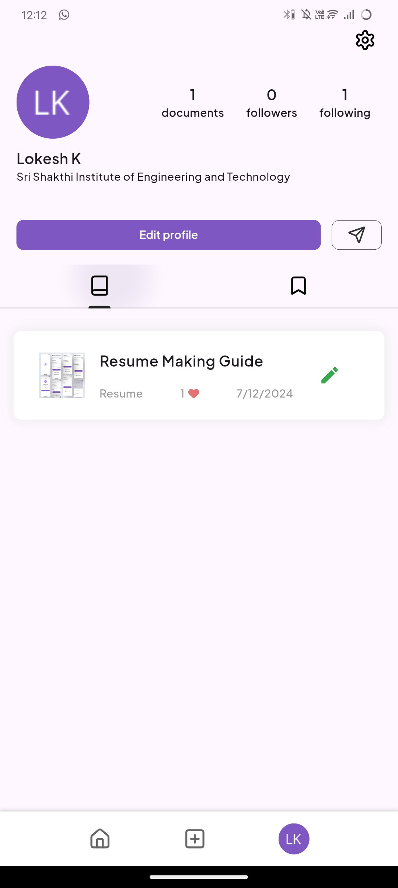
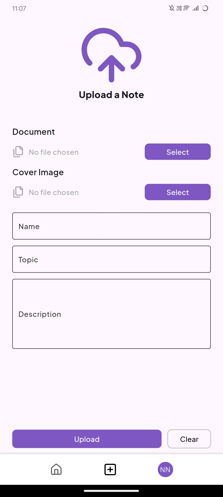
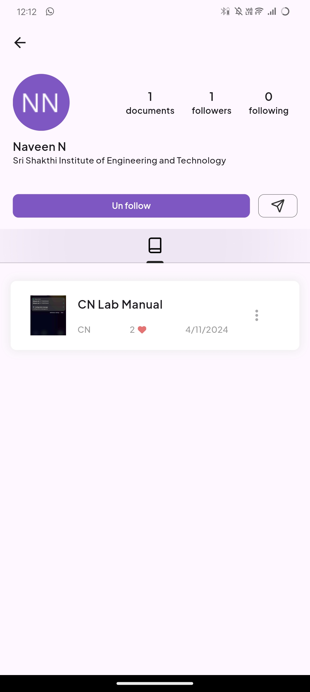

# NoteHub

## Overview
NoteHub is a mobile application developed using Flutter, designed to facilitate the sharing and accessing of study notes, lecture summaries, and educational resources among students. The app categorizes content based on subjects, allowing users to upvote quality notes and create personalized profiles to track and share their contributions.


## Features
- **User Authentication**: Secure login and registration with email or social media integration.
- **Profile Customization**: Users can set up and personalize their profiles with academic interests.
- **Content Upload**: Ability to upload notes in various formats including PDF, text, and images.
- **Advanced Search**: Includes filters to search by subject, date, or quality.
- **Interactive Engagement**: Users can upvote, downvote, and comment on shared notes.
- **Offline Access**: Functionality to download notes for offline reading.
- **Notifications**: Alerts for new notes and interactions on user-uploaded content.

## Tech Stack
- **Frontend**: Flutter
- **Backend**: Firebase for authentication and database services
- **Storage**: Cloud storage for notes and user data

## Installation

To set up the project locally, follow these steps:

   1. Clone the repository:
      ```
      git clone https://github.com/Navin82005/Notes-Sharing-Platform.git
      ```
      
   2. Navigate to the project directory:
      ```
      cd note_hub
      ```
      
   3. Install dependencies:
      ```
      flutter pub get
      ```
      
   4. Run the application:
      ```
      flutter run
      ```

## App Screenshots

Here are some screenshots demonstrating the app features:

| Home Page                      | Profile Page                   | Document Details             | Upload Page                  |
| ------------------------------ | ------------------------------ | ---------------------------- | ---------------------------- |
|  |  |  |  |
| Following Page                 | Followers Page                   | Saved Documents             | Download Page                 |
|  |  |  |  |
| Other Person Profile           |
|  |


## License
This project is licensed under the [License](LICENSE).

#


